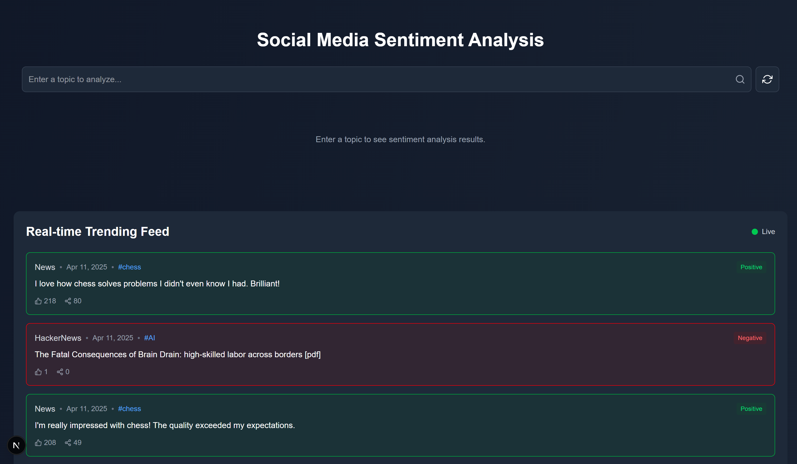

# SentiNews: Real-time News Sentiment Analysis Platform

SentiNews is a modern web application that analyzes sentiment trends across news and social media in real-time, providing insights into how topics are being discussed across the internet.



## Features

- **Real-time Sentiment Analysis**: Analyze the sentiment of news articles and social media posts as they are published
- **Topic-based Monitoring**: Track specific topics and receive live updates when new content is available
- **Interactive Visualizations**: View sentiment trends over time with interactive charts and graphs
- **Multi-platform Tracking**: Aggregate content from multiple sources including News API and HackerNews
- **Key Phrase Extraction**: Automatically identify important topics and phrases from analyzed content

## Tech Stack

- **Frontend**: Next.js 15, 
- **Real-time Updates**: Socket.IO
- **Natural Language Processing**: Sentiment analysis with custom lexicons
- **Data Visualization**: Chart.js
- **Styling**: TailwindCSS

## Getting Started

### Prerequisites

- Node.js 18.0 or higher
- npm or yarn

### Installation

1. Clone the repository:
   ```bash
   git clone https://github.com/Anway-Kapoor/SentiNews.git
   cd SentiNews
   ```

2. Install dependencies:
   ```bash
   npm install
   # or
   yarn install
   ```
3. Create a **.env** file in the root directory with the following variables:
   ```bash
   NEWS_API_KEY=your_news_api_key
   ```

4. Start the development server:
   ```bash
   npm run dev
   # or
   yarn dev
   ```
